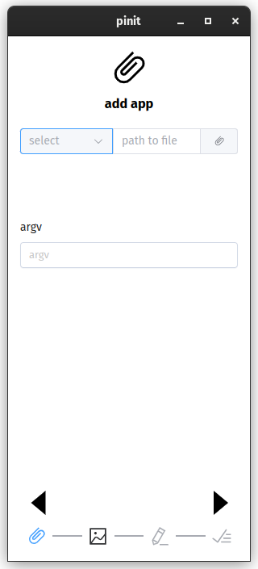
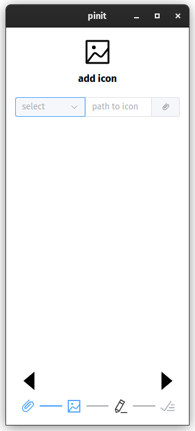
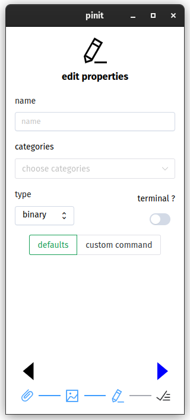

# pinit
## an application for creating shortcut for apps and scripts ( only for linux )

## installation
- using pip :
run this two commands in terminal
1. pip install pinit
2. pinit
- appimage :
just download pinit.AppImage file and run it
## commands
- pinit
- pinit install
- pinit uninstall
- pinit upgrade
- pinit upgrade --force
## screenshots

