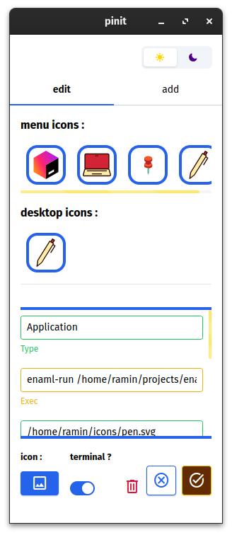
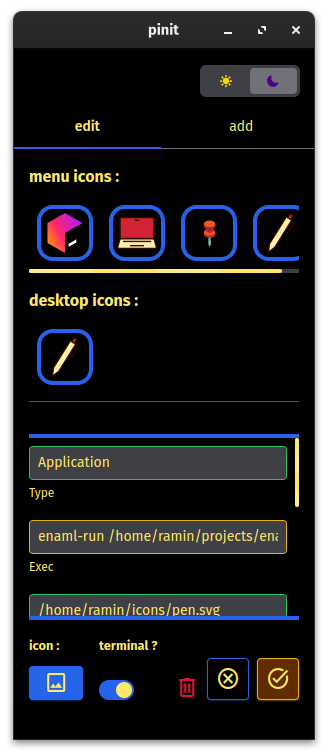

# pinit
## an application for creating shortcut for apps and scripts ( only for linux )

## installation
- using pip :
run this two commands in terminal :
```bash
pip install pinit
pinit install
```

or run :
```bash
pip install pinit && pinit install
```
<!-- - appimage : -->
<!-- just download pinit.AppImage file and run it -->
## screenshots



